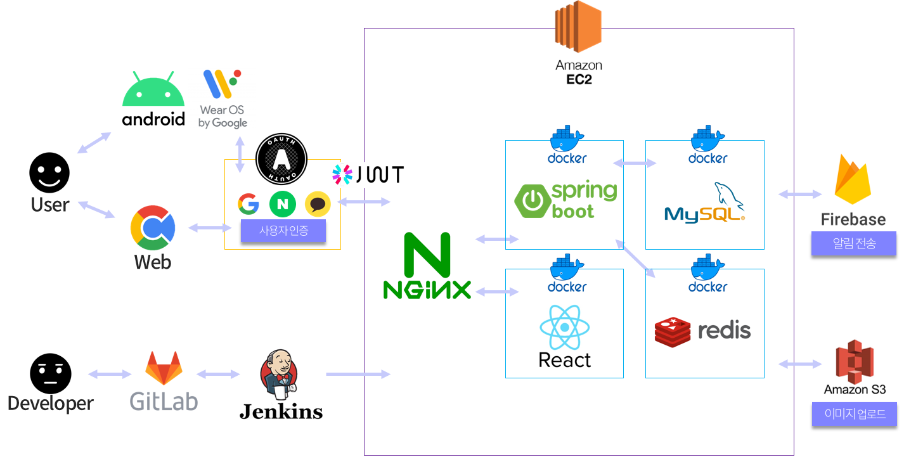
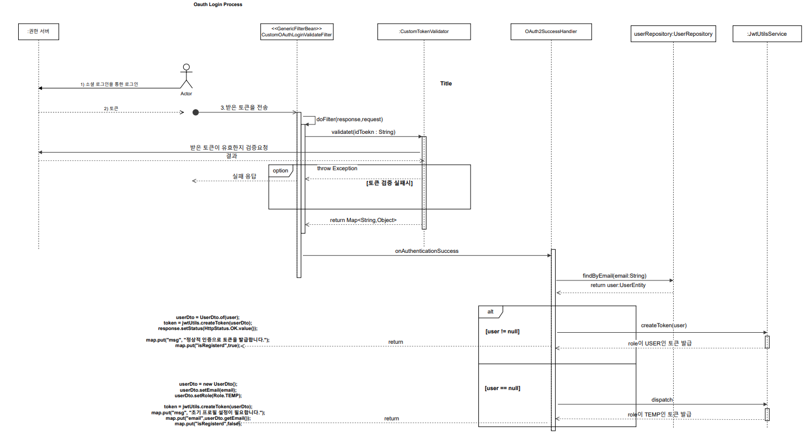

<div align="left">

</div>
<br/>

## 🏃🏻‍♂️ RunWithMe?

<font size="5" color="orange">**RunWithMe**</font> 프로젝트는 Android 모바일로 제공되는 비대면 러닝 챌린지 크루 어플리케이션입니다. 주요 기획 의도는 <strong>개발진의 역량 향상</strong>과 <strong>기존의 러닝 앱 서비스에 대한 불편점을 개선하고 보완한 새로운 러닝앱 개발</strong>이였습니다.
<br/>
평소 러닝을 즐기는 팀원들이 모여 직접 러닝 앱을 오랫동안 사용하면서 느낀 불편점을 개선하기 위해 적극적으로 기획하였으며 모두가 프로젝트의 주인의식을 가지고 직접 사용할 수 있는 러닝 앱을 제작하였습니다. 기존 서비스를 분석하며 최대한 사용자 편의성을 생각하고 코로나 시대에 증가하는 비대면 러닝 크루 기능에 대한 사용자들의 요구와 달리 기존 러닝앱들은 개인 러닝에만 초점이 맞춰져 있는 점을 고려하여 러닝 크루 기능에 초점을 맞춘 새로운 러닝 앱 서비스를 제공하고자 하였습니다.
<br/>

<h5>👟 러닝 진행 화면(15min)</h5>
<hr>


<br/>

<h5>🗺 스크랩 러닝 화면(15min)</h5>
<hr>


<br/>

<h5>🚨 비정상적인 움직임 감지 화면(자동차)</h5>
<hr>


<br/>

## 📃 Description

> <h3><font color="red">서비스 주요 기능</font></h3>

>  <br/>

> <br/>

>  <br/>

> <br/>

> <h3><font color="green">서비스 전체 기능</font></h3>

<ul>
	<li>챌린지 러닝 기능 - 챌린지마다 러닝 기간, 시간, 목표 등을 정해서 정해진 시간에만 러닝 가능</li>
	<li>러닝 기능 - 러닝을 뛰는 실시간 경로를 지도에 표기, 기록 표기</li>
	<li>러닝 기록 기능 - 러닝을 완료하고 경로 사진과 기록 등을 자동으로 등록 되게 하여 기록을 서로 공유할 수 있음. 누적 기록을 볼 수 있고 세부 러닝 기록을 캘린더 형식으로 볼 수 있음</li>
	<li>랭킹 기능 - 챌린지 내에서 거리별, 시간별 등으로 정렬하여 챌린지 팀원 랭킹을 볼 수 있고 전체 랭킹에서 유저별 랭킹을 볼 수 있음</li>
	<li>챌린지 내 소통 기능 - 게시판 기능을 통하여 챌린지 팀원들끼리 소통 가능</li>
	<li>업적 기능 - 업적 달성 시 뱃지를 지급</li>
	<li>대회 기능 - 시즌 내 기간 동안 달린 누적 거리로 랭킹 계산, 포인트와 뱃지 보상 지급</li>
	<li>추천 기능 - 러닝 완료 후 기록을 사용자들에게 추천할 수 있음</li>
	<li>스크랩 기능 - 사용자들이 올린 추천 경로를 스크랩을 할 수 있고 추천 경로를 러닝 화면에 나타내어 뛸 수 있음</li>
	<li>날씨 기능 - 최근 30분 이내의 예보를 통해 현재 날씨 확인 가능</li>
	<li>TTS 기능 - 러닝 시작, 정지 시, 그리고 1km마다 소요 시간을 음성으로 알려줌</li>
	<li>워치 연동 기능 - 워치와 로그인을 연동 가능</li>
	<li>워치 러닝 기능 - 워치로도 러닝 기능이 가능</li>
	<li>신고 기능 - 불편한 게시물을 신고 할 수 있음</li>
	<li>문의 기능 - 문의할 수 있음</li>
</ul>
<br/>
<br/>

## 📝 Design

> <h3><font color="green">전체 기술 스택</font></h3>

>  > <br/>

> <h3><font color="green">전체 시스템 구조</font></h3>

>  > <br/>

> <h3><font color="green">ERD 다이어그램</font></h3>

>  > [링크](https://www.erdcloud.com/d/uoAsmnv3gyCugnxno) 바로가기
> <br/>

> <h3><font color="green">요구사항 명세서</font></h3>

>  <br/>

> <br/>
> <br/>

> <h3><font color="green">API 명세서</font></h3>

>  <br/>

> <br/>
> <br/>

## 📱 Android

> <h3><font color="green">사용한 라이브러리</font></h3>

| Name             | Description                                  |
| ---------------- | -------------------------------------------- |
| Data Layer API   | Wear OS 네트워크 통신 라이브러리             |
| Navigation       | 프래그먼트 전환 라이브러리                   |
| Glide            | 이미지 로딩 라이브러리                       |
| ViewModel        | 수명주기 고려 데이터를 저장, 관리 라이브러리 |
| Coroutine        | 비동기 처리 라이브러리                       |
| Coroutine Flow   | 비동기 데이터 스트림                         |
| TedPermission    | 안드로이드 권한 라이브러리                   |
| Retrofit         | HTTP 통신 라이브러리                         |
| SimpleRatingBar  | RatingBar 커스텀 라이브러리                  |
| Dagger Hilt      | 의존성 주입 라이브러리                       |
| Circle ImageView | 이미지뷰 라이브러리                          |
| Google Auth      | 구글 소셜 로그인                             |
| Naver            | 네이버 소셜 로그인                           |
| KaKao            | 카카오 소셜 로그인                           |
| Lottie           | 안드로이드 애니메이션 라이브러리             |
| GoogleMap        | 구글 지도 라이브러리                         |
| FCM              | 파이어베이스 푸시 알림                       |
| Paging 3         | 안드로이드 페이징 라이브러리                 |
| Mp Android Chart | 안드로이드 차트 통계 라이브러리              |
| Room             | 안드로이드 DB 라이브러리                     |
| Weather Api      | 공공데이터포털 기상청 날씨 라이브러리        |
| CalendarView     | 캘린더 라이브러리                            |

<br/>

> <h3><font color="green">디렉토리 구조</font></h3>

```markdown
📁AOS
├──📁api
├──📁base
├──📁binding
├──📁datasource
│ ├──📁local
│ ├──📁paging
├──📁db
├──📁di
├──📁model
│ ├──📁dto
│ ├──📁entity
│ ├──📁response
├──📁repository
├──📁service
├──📁utils
└──📁view
├──📁competition
│ ├──📁ranking
├──📁create_recommend
├──📁crew_detail
│ ├──📁board
│ │ ├──📁create
│ ├──📁my_record
│ ├──📁ranking
│ ├──📁user_record
├──📁crew_recruit
│ ├──📁create
│ ├──📁detail
│ ├──📁search
│ │ ├──📁result
├──📁home
│ ├──📁my_crew
│ ├──📁ranking
│ ├──📁tab
│ │ ├──📁crew
│ │ ├──📁home
├──📁loading
├──📁login
│ ├──📁join
│ ├──📁login
├──📁mypage
│ ├──📁edit_profile
│ ├──📁others
│ ├──📁recommned_scrap
│ ├──📁tab
│ │ ├──📁achievement
│ │ ├──📁my_board
│ │ ├──📁total_record
│ │ │ ├──📁local_run
├──📁permission
├──📁recommend
├──📁route_detail
├──📁run_record_detail
├──📁running
│ ├──📁list
│ │ ├──📁sheet
│ │ │ ├──📁custom
│ ├──📁result
│ │ ├──📁achievement
├──📁user_detail
```

<br/>

> <h3><font color="green">아키텍처 구조</font></h3>

>  > <br/> > <br/>

## 💽 Back-End

> <h3><font color="green">사용한 라이브러리</font></h3>

| 사용라이브러리                              | 사용이유                                                                |
| ------------------------------------------- | ----------------------------------------------------------------------- |
| aop                                         | 서비스 입력 반환 로깅 처리                                              |
| firebase-admin                              | 구글 Oauth 토큰 검증, FCM 서비스 이용                                   |
| jackson-datatype-jsr310                     | LocalDateTime Json 변환,반환 포맷 지정                                  |
| coomons-fileupload ,commons-io              | 파일 업로드                                                             |
| spring-cloud-starter-aws                    | aws S3서비스 사용                                                       |
| jjwt-api,jjwt-impl,jjwt-jackson             | 인증 인가에 사용할 jwt토큰 생성 및 검증                                 |
| spring-boot-starter-data-jpa                | Mysql 에 관리,조작하기 위한 JPA API                                     |
| spring-boot-starter-security                | 인증,인가 특히 권한관리를 쉽게 해주는 스프링 하위 프레임워크            |
| springfox-swagger-ui,springfox-boot-starter | API 명세                                                                |
| mysql-connector-java                        | DBMS                                                                    |
| lombok                                      | 컴파일 타임 코드 자동 생성기                                            |
| querydsl-apt, querydsl-jpa                  | JPA 사용 시에 복잡한 쿼리 처리에 사용                                   |
| spring-boot-starter-validation              | 사용자의 입력에 대한 유효성 검사에 도움을 주는 라이브러리               |
| spring-boot-starter-data-redis              | 휘발성 인메모리 저장소, 중복처리에 사용                                 |
| spring boot batch                           | 포인트 정산, 알림 발송과 같은 scheduled로 지정된 시간의 일괄처리에 사용 |

<br/>

> <h3><font color="green">디렉토리 구조</font></h3>

```markdown
📁backend
└──📁src/main
├──📁java/com/ssafy/d101
│ ├──📃Gumid101Application.java
│ ├──📁achievement
│ ├──📁aop
│ ├──📁aws
│ ├──📁competition
│ ├──📁config
│ ├──📁controller.advice
│ ├──📁crew
│ ├──📁crew.activity
│ ├──📁crew.manager
│ ├──📁customercenter
│ ├──📁customercenter.manager
│ ├──📁customexception
│ ├──📁dto
│ └──📁entity
│ │ ├──📃AchievementCompleteEntity.java
│ │ ├──📃AchievementEntity.java
│ │ ├──📃CompetitionEntity.java
│ │ ├──📃CompetitionUserRecordEntity.java
│ │ ├──📃CrewBoardEntity.java
│ │ ├──📃CrewTotalRecordEntity.java
│ │ ├──📃...
│ │ └──📃UserEntity.java
│ ├──📁firebase
│ ├──📁imgfile
│ ├──📁interceptor
│ ├──📁jwt
│ ├──📁OAuth
│ ├──📁OAuth.custom.validate
│ ├──📁recomment
│ ├──📁redis
│ ├──📁req
│ ├──📁res
│ ├──📁schedule
│ └──📁scrap
│ │ ├──📃ScrapRepository.java
│ │ ├──📃ScrapController.java
│ │ ├──📃ScrapService.java
│ │ └──📃ScrapServiceImpl.java
│ ├──📁totalranking
│ ├──📁user
│ └──📁util
├──📁resources
│ ├──📃application.yml
│ ├──📃application-aws.yml
│ ├──📃application-firebase.yml
│ ├──📃application-oauth.yml
│ └──📁firebase
│ └──📃runwithme-...-.json
├──📃.gitignore
├──📃pom.xml
└──📃dockerfile.yml
```

<br/>

> <h3><font color="green">패키지 다이어그램</font></h3>

> 

> 도메인 별로 패키지를 구분하려고 하였다. 하지만 req,res,dto의 경우
> 도메인 별로 구분하지 않고 하나의 패키지에 모아서 처리하였다.
> <br/>

> <h3><font color="green">인증 처리과정</font></h3>

> 

> 클라이언트에서 OAuth Provider로 부터 받은 id_token, authorized_code 혹은 AccessToken를
> 서버에 전달하고 서버에서 다시 OAuth Provider로 요청하여 검증을 수행한다.<br/>
> 검증이 정상일 경우 서버에서는 자신의 로직을 통해 서버의 자원에 접근할 수 있는 JWT 토큰을 발급한다.
> <br/> > <br/>

## 👨‍👦‍👦 Team Member

> <h3><font color="red">Android Part</font></h3>


> <br/>

> <h3><font color="red">Back-End Part</font></h3>


> <br/>
> <br/>

## 🏷 License

<p>
This software is licensed under the MIT <a href="https://www.ssafy.com/ksp/jsp/swp/swpMain.jsp" _blank="new">©SSAFY</a>.
</p>
